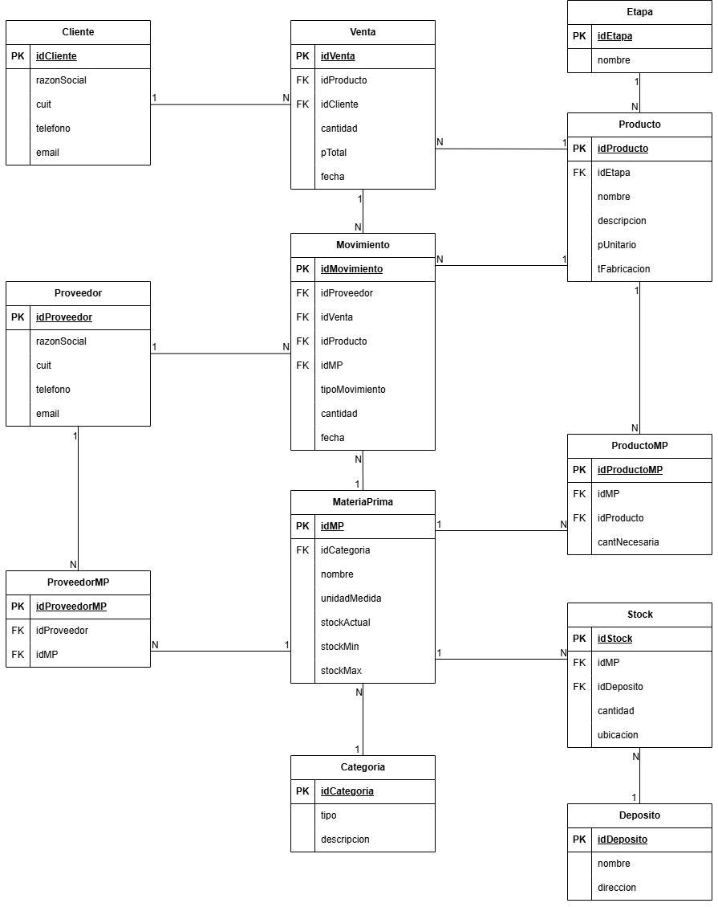

# 🏭 Proyecto de Base de Datos: Metalúrgica Racks & Soluciones

Este repositorio contiene el diseño y la implementación de una base de datos relacional en SQL Server, creada para automatizar y optimizar la gestión de inventario y producción de la empresa "Induestant - Metalúrgica Racks & Soluciones".

## 🎯 Problema a Resolver

La empresa se encontraba en una etapa de crecimiento con un sistema de control de stock manual y obsoleto. Esto generaba problemas críticos que afectaban la productividad y la planificación:

  - **Errores Frecuentes:** El registro manual en papel generaba inconsistencias y pérdida de información.
  - **Falta de Control:** Desconocimiento del inventario real disponible.
  - **Mala Gestión del Espacio:** Inexistencia de un sistema de ubicación física, provocando demoras en la búsqueda de materiales.
  - **Tiempos Muertos en Producción:** Dificultades para planificar compras y nuevas fabricaciones por falta de datos fiables.

## 🚀 Objetivos del Proyecto

El objetivo principal fue diseñar e implementar un sistema de gestión de stock en SQL que permitiera a la metalúrgica:

  - ✅ **Registrar** de forma automática las entradas y salidas de materia prima y productos.
  - 🗺️ **Controlar** la ubicación física exacta de cada material dentro del depósito.
  - 🔗 **Relacionar** materias primas con productos terminados (Bill of Materials) para conocer los insumos de cada fabricación.
  - 🚨 **Generar alertas** cuando un material esté por debajo del stock mínimo o por encima del stock máximo.
  - 📋 **Guardar un historial** completo de movimientos, con fecha, tipo, cantidad y responsable.

## 🏛️ Modelo de la Base de Datos (DER Lógico)

Este es el plano final de la base de datos. El modelo lógico muestra todas las tablas, sus atributos y las relaciones que garantizan la integridad y eficiencia del sistema.



## 🛠️ Tecnologías Utilizadas

  - **SGBD:** SQL Server
  - **Lenguaje:** T-SQL (Transact-SQL)
  - **Herramienta:** SQL Server Management Studio (SSMS)

## 📂 Estructura del Repositorio

```
.
├── diagramas/
│   ├── modelo_Conceptual.png
│   └── modelo_Logico.jpg
├── InduestantDB.sql
└── README.md
```

  - **`/Diagramas`**: Contiene los diagramas Entidad-Relación (Conceptual y Lógico) del proyecto.
  - **`InduestantDB.sql`**: Script principal de T-SQL que contiene el código para crear la base de datos, todas las tablas y sus restricciones (Modelo Físico).
  - **`README.md`**: Este archivo.

## ✨ Características Principales

  - **Control de Inventario Automatizado:** El stock de materias primas y productos se actualiza automáticamente con cada movimiento, utilizando los atributos `stockActual`, `stockMin` y `stockMax` para generar alertas.
  - **Trazabilidad Completa:** La tabla `Movimiento` actúa como un libro de auditoría, registrando cada entrada, salida o ajuste, y permitiendo vincularlo a un proveedor, una venta o un producto.
  - **Gestión de Ubicación Física:** La tabla `Stock` permite asignar una ubicación específica (ej: "Pasillo A, Estante 3") a cada lote de material en un depósito, eliminando la confusión y acelerando la logística.
  - **Recetas de Productos:** La tabla `ProductoMP` define con precisión la cantidad de cada materia prima necesaria para fabricar una unidad de un producto terminado.
  - **Gestión de Compras y Ventas:** El sistema integra la gestión de `Proveedores` y `Clientes`, conectando las transacciones comerciales (`Venta`) con los movimientos logísticos.
